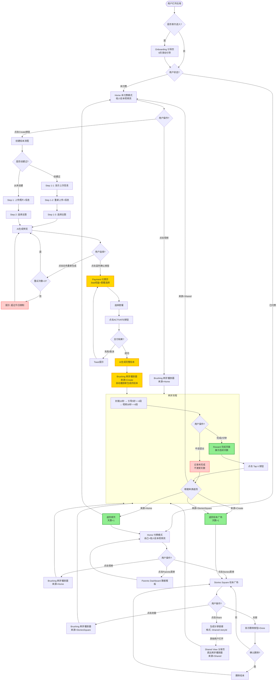
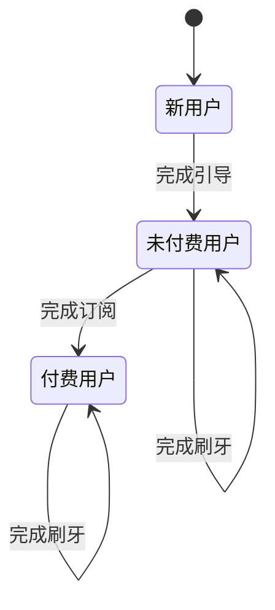
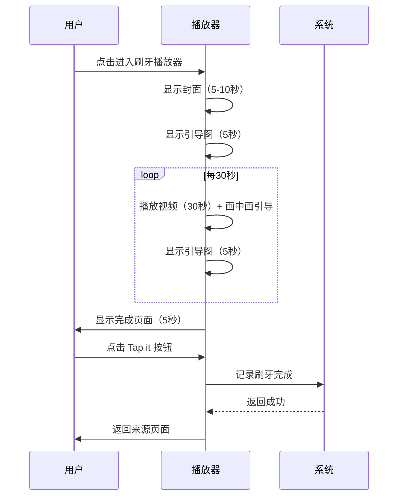

# 产品需求文档：BrushBuddy H5 - V1.0

## 文档信息

| 项目 | 信息 |
|------|------|
| **产品名称** | BrushBuddy（儿童刷牙 AI 陪伴绘本） |
| **版本** | V1.0 |
| **文档日期** | 2026-01-27 |
| **目标市场** | 美国 |
| **目标用户** | 1-6 岁学龄前儿童及其父母 |

---

## 1. 综述 (Overview)

### 1.1 项目背景与核心问题

**核心问题**：美国学龄前儿童（1-6岁）普遍存在刷牙挑战，包括：
- 缺乏刷牙兴趣，被动刷牙
- 不掌握正确的刷牙方法
- 父母每天督促刷牙，耗费大量时间和精力

**产品定位**：通过 AI 生成的个性化刷牙绘本，让孩子成为故事的主角，在观看有趣绘本故事的过程中，跟随分区引导完成正确的刷牙方法。

**核心价值**：
- **个性化**：上传孩子照片生成专属主角，提升参与感
- **兴趣驱动**：绘本故事形式让孩子主动刷牙
- **正确引导**：2分钟分区引导（左上牙、右上牙、左下牙、右下牙）
- **父母减负**：自动记录刷牙数据，节省父母陪伴时间

---

### 1.2 核心业务流程 / 用户旅程地图

```
┌─────────────────────────────────────────────────────────────────┐
│                        BrushBuddy 用户路径全景图                   │
├─────────────────────────────────────────────────────────────────┤
│                                                                 │
│  【路径A】未付费转化路径                                          │
│  Onboarding → Home(未) → Create → Payment → Home(已)            │
│                                                                 │
│  【路径B1】付费用户日常-首页进入                                   │
│  Home(已) → Brushing → Reward → Home(已)                         │
│                                                                 │
│  【路径B2】付费用户日常-绘本广场进入                               │
│  Home(已) → Stories Square → Brushing → Reward → Home(已)      │
│                                                                 │
│  【路径C】未付费用户日常                                          │
│  Home(未) → Brushing → Reward → Home(未)                         │
│                                                                 │
│  【路径D】分享链接进入                                            │
│  Shared View → Brushing → Reward → Home                         │
│                                                                 │
└─────────────────────────────────────────────────────────────────┘
```

**用户旅程分阶段说明**：

1.  **阶段一：首次进入与引导** - 让用户理解产品价值
2.  **阶段二：首页探索** - 浏览绘本内容，引导转化
3.  **阶段三：创建与付费转化** - 创建个性化绘本，完成订阅
4.  **阶段四：刷牙陪伴** - 2分钟分区引导刷牙
5.  **阶段五：数据与探索** - 管理绘本，查看数据，分享

---

### 1.3 Mermaid 图

#### 1.3.1 用户操作流（核心流程）



#### 1.3.2 用户状态机



#### 1.3.3 刷牙播放器时序



---

## 2. 用户故事详述 (User Stories)

### 阶段一：首次进入与引导

---

#### **US-01: 首次进入引导 (Onboarding)**

> **状态**：⏭️ 跳过（代码已完成）

*此功能代码已实现，本次 PRD 不展开详述。*

**对应 UI 图**：
- `frontend/public/images/onboarding-slide1.png`
- `frontend/public/images/onboarding-slide2.png`
- `frontend/public/images/onboarding-slide3.png`
- `frontend/public/images/onboarding-slide4.png`
- `frontend/public/images/onboarding-slide5.png`
- `frontend/public/images/onboarding-slide6.png`
- `frontend/public/images/onboarding-slide7.png`
- `frontend/public/images/onboarding-slide8.png`
- `frontend/public/images/onboarding-slide9.png`

---

### 阶段二：首页探索

---

#### **US-02: 首页探索 (Home)**

*   **价值陈述 (Value Statement)**:
    *   **作为** 一个新用户或付费用户
    *   **我希望** 在首页浏览有趣的刷牙绘本视频
    *   **以便于** 选择一个开始陪伴孩子刷牙

*   **业务规则与逻辑 (Business Logic)**:
    1.  **前置条件**:
        - 用户已完成 Onboarding 或已注册
    2.  **操作流程 (Happy Path)**:
        - 新用户（无刷牙记录）：不显示连续天数板块，显示他人绘本视频流
        - 有刷牙记录：顶部显示"连续刷牙 X 天"
        - 未付费用户：显示他人绘本视频流（无限滑动）
        - 付费用户（未创建绘本）：显示他人绘本视频流
        - 付费用户（已创建绘本）：显示自己绘本 + 他人绘本（混合展示）
        - 视频自动播放有声音，滑动切换后自动播放新视频
        - 点击视频区域进入刷牙播放器
        - 未付费用户显示蓝色"Create your child's first brushing story"按钮
    3.  **异常处理 (Error Handling)**:
        - 视频加载失败：Toast 提示"视频加载失败，请检查网络"
        - 付费用户未创建绘本：维持可浏览他人绘本状态
        - 无绘本数据：显示空状态提示

*   **验收标准 (Acceptance Criteria)**:
    *   **场景1: 新用户进入首页**
        -   **GIVEN** 用户无刷牙记录
        -   **WHEN** 进入首页
        -   **THEN** 不显示连续天数板块，自动播放第1个视频
    *   **场景2: 有刷牙记录的用户**
        -   **GIVEN** 用户有刷牙记录
        -   **WHEN** 进入首页
        -   **THEN** 顶部显示"连续刷牙 X 天"
    *   **场景3: 未付费用户**
        -   **GIVEN** 用户未付费
        -   **WHEN** 进入首页
        -   **THEN** 显示他人绘本视频流 + 蓝色创建按钮
    *   **场景4: 付费用户已创建绘本**
        -   **GIVEN** 用户已付费并创建过绘本
        -   **WHEN** 进入首页
        -   **THEN** 显示自己绘本 + 他人绘本视频流
    *   **场景5: 视频加载失败**
        -   **GIVEN** 视频加载失败
        -   **WHEN** 播放视频时
        -   **THEN** 显示 Toast："视频加载失败，请检查网络"

*   **页面布局线框图 (ASCII Wireframe)**:
    ```text
    ┌─────────────────────────────────────────────────────────────────┐
    │                         Home View                               │
    ├─────────────────────────────────────────────────────────────────┤
    │                                                                 │
    │  ┌───────────────────────────────────────────────────────────┐ │
    │  │  ┌─────────────────────────────────────────────────────┐  │ │
    │  │  │              连续刷牙 5 天                            │  │ │ ← 仅当有刷牙记录时显示
    │  │  └─────────────────────────────────────────────────────┘  │ │
    │  │                                                           │ │
    │  │                    ┌─────────────┐                        │ │
    │  │                    │  视频播放区  │                        │ │ ← 全屏播放
    │  │                    └─────────────┘                        │ │   滑动切换
    │  │                                                           │ │   自动播放+声音
    │  └───────────────────────────────────────────────────────────┘ │
    │                                                                 │
    │  ┌───────────────────────────────────────────────────────────┐ │
    │  │  [蓝色按钮] Create your child's first brushing story      │ │ ← 仅未付费用户显示
    │  └───────────────────────────────────────────────────────────┘ │
    │                                                                 │
    │  ┌───────────────────────────────────────────────────────────┐ │
    │  │  ┌────────┐  ┌────────┐  ┌────────┐  ┌────────┐         │ │
    │  │  │  🏠   │  │  ✨   │  │  📖   │  │  👨‍👩‍👧  │         │ │ ← 底部导航（4个菜单）
    │  │  │  Home │  │ Create│  │Stories│  │Parents│         │ │   当前激活高亮
    │  │  └────────┘  └────────┘  └────────┘  └────────┘         │ │
    │  └───────────────────────────────────────────────────────────┘ │
    │                                                                 │
    └─────────────────────────────────────────────────────────────────┘
    ```

**对应 UI 图**：
- `frontend/public/images/home-new-user-1.png`（未付费用户首页示例1）
- `frontend/public/images/home-new-user-2.png`（未付费用户首页示例2）
- `frontend/public/images/home-new-user-3.png`（未付费用户首页示例3）
- `frontend/public/images/home-old-user.png`（付费用户首页）

---

### 阶段三：创建与付费转化

---

#### **US-03: Step 1 上传信息**

*   **价值陈述 (Value Statement)**:
    *   **作为** 一个家长
    *   **我希望** 上传孩子的照片和基本信息
    *   **以便于** 为孩子生成个性化的刷牙绘本角色

*   **业务规则与逻辑 (Business Logic)**:
    1.  **前置条件**:
        - 用户点击创建按钮
    2.  **操作流程 (Happy Path)**:
        - **从未创建过**：
            - 上传孩子照片（调起相机模块，选择拍照/相册）
            - 输入昵称（最多15个字符）
            - 选择性别（男生/女生/不想透露）
            - 选择年龄（1-12岁下拉选择）
            - 点击"Next Step"跳转 Step 2
        - **创建过**：
            - 显示上一次的照片和信息
            - 点击"+"按钮可重新上传
            - 确认后跳转 Step 1-2 重新填写
    3.  **异常处理 (Error Handling)**:
        - 必填项未填：Toast 提示"请填写所有必填信息"
        - 照片格式不支持：Toast 提示"不支持该图片格式"
        - 照片过大：Toast 提示"图片大小不能超过5MB"

*   **验收标准 (Acceptance Criteria)**:
    *   **场景1: 从未创建过**
        -   **GIVEN** 用户从未创建过绘本
        -   **WHEN** 进入创建流程
        -   **THEN** 显示上传照片、昵称、性别、年龄输入框
    *   **场景2: 创建过用户**
        -   **GIVEN** 用户创建过绘本
        -   **WHEN** 进入创建流程
        -   **THEN** 显示上一次的照片和信息，可点击"+"重新上传
    *   **场景3: 必填项验证**
        -   **GIVEN** 有必填项未填
        -   **WHEN** 点击"Next Step"
        -   **THEN** 显示 Toast："请填写所有必填信息"

*   **页面布局线框图 (ASCII Wireframe)**:
    ```text
    ┌─────────────────────────────────────────────────────────────────┐
    │                   Create Step 1: Upload Info                    │
    ├─────────────────────────────────────────────────────────────────┤
    │  ←  [返回箭头]                                   9:41            │
    │                                                                 │
    │  ┌───────────────────────────────────────────────────────────┐ │
    │  │                  上传孩子的照片                             │ │
    │  │              ┌──────────────────┐                        │ │
    │  │              │   [相机图标]      │   ← 点击调起相机       │ │
    │  │              └──────────────────┘                        │ │
    │  └───────────────────────────────────────────────────────────┘ │
    │                                                                 │
    │  ┌───────────────────────────────────────────────────────────┐ │
    │  │  孩子的昵称                                                │ │
    │  │  ┌─────────────────────────────────────────────────────┐  │ │
    │  │  │                                                     │  │ │
    │  │  └─────────────────────────────────────────────────────┘  │ │
    │  │                    最多 15 个字符                         │ │
    │  └───────────────────────────────────────────────────────────┘ │
    │                                                                 │
    │  ┌───────────────────────────────────────────────────────────┐ │
    │  │  性别                                                      │ │
    │  │  ┌────────┐  ┌────────┐  ┌────────┐                     │ │
    │  │  │  男生  │  │  女生  │  │ 不想透露│                     │ │ ← 单选
    │  │  └────────┘  └────────┘  └────────┘                     │ │
    │  └───────────────────────────────────────────────────────────┘ │
    │                                                                 │
    │  ┌───────────────────────────────────────────────────────────┐ │
    │  │  年龄                                                      │ │
    │  │  ┌─────────────────────────────────────────────────────┐  │ │
    │  │  │  1-12 岁                                   ↓       │  │ │ ← 下拉选择
    │  │  └─────────────────────────────────────────────────────┘  │ │
    │  └───────────────────────────────────────────────────────────┘ │
    │                                                                 │
    │  ┌───────────────────────────────────────────────────────────┐ │
    │  │                   [  Next Step  ]                         │ │ ← 蓝色按钮
    │  └───────────────────────────────────────────────────────────┘ │
    │                                                                 │
    └─────────────────────────────────────────────────────────────────┘
    ```

**对应 UI 图**：
- `frontend/public/images/create-new-1.png`（从未创建过的 Step 1）
- `frontend/public/images/create-step-1-1.png`（创建过用户的 Step 1-1）
- `frontend/public/images/create-step-1-2.png`（Step 1-2 重新上传）
- `frontend/public/images/create-step-1-3.png`（Step 1-3 选择主题）

---

#### **US-04: Step 2 选择主题**

*   **价值陈述 (Value Statement)**:
    *   **作为** 一个家长
    *   **我希望** 为孩子的绘本选择一个有趣的主题
    *   **以便于** 让刷牙故事更符合孩子的兴趣偏好

*   **业务规则与逻辑 (Business Logic)**:
    1.  **前置条件**:
        - 用户已完成 Step 1
    2.  **操作流程 (Happy Path)**:
        - 显示多个主题卡片（太空冒险、海洋探险、森林奇遇等）
        - 用户点击选择一个主题（单选）
        - 选中主题后高亮显示
        - 点击"Next Step"跳转 AI 预览
        - 点击"Previous"返回 Step 1
    3.  **异常处理 (Error Handling)**:
        - 未选择主题时点击"Next Step"：Toast 提示"请选择一个主题"

*   **验收标准 (Acceptance Criteria)**:
    *   **场景1: 正常选择主题**
        -   **GIVEN** 用户在主题选择页
        -   **WHEN** 点击主题卡片
        -   **THEN** 主题高亮选中
    *   **场景2: 未选择跳过**
        -   **GIVEN** 用户未选择任何主题
        -   **WHEN** 点击"Next Step"
        -   **THEN** 显示 Toast："请选择一个主题"

*   **页面布局线框图 (ASCII Wireframe)**:
    ```text
    ┌─────────────────────────────────────────────────────────────────┐
    │                   Create Step 2: Choose Theme                   │
    ├─────────────────────────────────────────────────────────────────┤
    │  ←  [返回箭头]                                   9:41            │
    │                                                                 │
    │  ┌───────────────────────────────────────────────────────────┐ │
    │  │                   选择一个主题                              │ │
    │  │   ┌─────────────┐  ┌─────────────┐  ┌─────────────┐     │ │
    │  │   │  主题预览图  │  │  主题预览图  │  │  主题预览图  │     │ │
    │  │   ├─────────────┤  ├─────────────┤  ├─────────────┤     │ │
    │  │   │  太空冒险    │  │  海洋探险    │  │  森林奇遇    │     │ │
    │  │   └─────────────┘  └─────────────┘  └─────────────┘     │ │
    │  │   ┌─────────────┐  ┌─────────────┐  ┌─────────────┐     │ │
    │  │   │  主题预览图  │  │  主题预览图  │  │  主题预览图  │     │ │
    │  │   ├─────────────┤  ├─────────────┤  ├─────────────┤     │ │
    │  │   │  城市英雄    │  │  梦幻城堡    │  │  动物朋友    │     │ │
    │  │   └─────────────┘  └─────────────┘  └─────────────┘     │ │
    │  └───────────────────────────────────────────────────────────┘ │
    │                                                                 │
    │  ┌───────────────────────────────────────────────────────────┐ │
    │  │                   [  Next Step  ]                         │ │
    │  └───────────────────────────────────────────────────────────┘ │
    │                                                                 │
    └─────────────────────────────────────────────────────────────────┘
    ```

**对应 UI 图**：
- `frontend/public/images/create-new-2.png`（Step 2 选择主题）

---

#### **US-05: Step 3 AI 预览**

*   **价值陈述 (Value Statement)**:
    *   **作为** 一个家长
    *   **我希望** 预览 AI 生成的绘本封面和介绍
    *   **以便于** 确认满意后再决定付费订阅

*   **业务规则与逻辑 (Business Logic)**:
    1.  **前置条件**:
        - 用户已完成 Step 1 和 Step 2
    2.  **操作流程 (Happy Path)**:
        - 进入页面显示 Loading，等待 AI 生成
        - AI 生成封面图 + 绘本名称 + 第一页内容
        - 显示"Public"开关（默认关闭）
        - 点击"Yes, Create Full Book!"跳转付费页
        - 点击"No, Change..."重新生成（每日最多3次）
        - 点击"Previous"返回 Step 2
    3.  **异常处理 (Error Handling)**:
        - AI 生成失败：Toast 提示"生成失败，请重新尝试"
        - 超过重新生成限制：Toast 提示"今日重新生成次数已用完，明天再试"
        - 超时（30秒）：Toast 提示"生成超时，请重新尝试"

*   **验收标准 (Acceptance Criteria)**:
    *   **场景1: 正常生成预览**
        -   **GIVEN** 用户完成 Step 2
        -   **WHEN** 进入预览页
        -   **THEN** 显示 Loading，完成后显示封面、名称、内容
    *   **场景2: 重新生成**
        -   **GIVEN** 用户对预览不满意
        -   **WHEN** 点击"重新生成"且未超限
        -   **THEN** 显示 Loading，重新生成内容
    *   **场景3: 超过限制**
        -   **GIVEN** 用户已重新生成3次
        -   **WHEN** 点击"重新生成"
        -   **THEN** 显示 Toast："今日重新生成次数已用完，明天再试"

*   **页面布局线框图 (ASCII Wireframe)**:
    ```text
    ┌─────────────────────────────────────────────────────────────────┐
    │                   Create a story                                │
    ├─────────────────────────────────────────────────────────────────┤
    │  ←  [返回箭头]                                   9:41            │
    │                                                                 │
    │  Previewing: page 1                                             │
    │                                                                 │
    │  ┌───────────────────────────────────────────────────────────┐ │
    │  │                   [ AI 生成的封面图 ]                       │ │
    │  └───────────────────────────────────────────────────────────┘ │
    │                                                                 │
    │  ┌───────────────────────────────────────────────────────────┐ │
    │  │  Jane's Little Space Trip                                │ │
    │  │  Jane was a shy girl. She loved to look at                │ │
    │  │  the night sky.                                           │ │
    │  └───────────────────────────────────────────────────────────┘ │
    │                                                                 │
    │  ┌───────────────────────────────────────────────────────────┐ │
    │  │  Public: Others can read this book.              [⚪ 关]  │ │ ← 开关，默认关闭
    │  └───────────────────────────────────────────────────────────┘ │
    │                                                                 │
    │  Does the character and story style look correct?              │
    │                                                                 │
    │  ┌───────────────────────────────────────────────────────────┐ │
    │  │          Yes, Create Full Book!                            │ │ ← 蓝色主按钮
    │  └───────────────────────────────────────────────────────────┘ │
    │                                                                 │
    │  ┌───────────────────────────────────────────────────────────┐ │
    │  │       No, Change World View (Regenerate)                   │ │ ← 白色次按钮
    │  └───────────────────────────────────────────────────────────┘ │
    │                                                                 │
    └─────────────────────────────────────────────────────────────────┘
    ```

**对应 UI 图**：
- `frontend/public/images/create-preview.png`（AI 预览页面）

---

#### **US-06: 付费引导页**

*   **价值陈述 (Value Statement)**:
    *   **作为** 一个未付费用户
    *   **我希望** 了解订阅权益并选择套餐
    *   **以便于** 完成付费后生成完整的个性化绘本

*   **业务规则与逻辑 (Business Logic)**:
    1.  **前置条件**:
        - 用户已完成 Step 3 AI 预览
    2.  **操作流程 (Happy Path)**:
        - 显示 3 个 Tab 权益说明（每3秒自动轮播）
        - 用户手动点击时暂停轮播
        - 显示三种套餐：月付 $8.99/月、季度 $21.99/季、年度 $66.99/年
        - 默认选中季度计划
        - 点击"ACTIVATE"拉起支付（Apple IAP / PayPal）
        - 支付成功后跳转 AI 生成完整绘本
    3.  **异常处理 (Error Handling)**:
        - 支付失败：Toast 提示"支付失败，请重试"，停留在当前页面
        - 支付超时：Toast 提示"支付超时，请重试"
        - IAP 验证失败：Toast 提示"购买验证失败，请联系客服"

*   **验收标准 (Acceptance Criteria)**:
    *   **场景1: 正常支付流程**
        -   **GIVEN** 用户在付费页
        -   **WHEN** 选择套餐并点击"ACTIVATE"
        -   **THEN** 拉起支付，成功后跳转 AI 生成
    *   **场景2: 支付失败**
        -   **GIVEN** 支付失败
        -   **WHEN** 支付完成
        -   **THEN** 显示 Toast 提示，停留在付费页

*   **页面布局线框图 (ASCII Wireframe)**:
    ```text
    ┌─────────────────────────────────────────────────────────────────┐
    │                    Subscribe & Save                             │
    ├─────────────────────────────────────────────────────────────────┤
    │  ←  [返回箭头]                              [ ✕ 关闭 ]          │
    │                                                                 │
    │  ┌───────────────────────────────────────────────────────────┐ │
    │  │              [ 权益说明插图/图标 ]                          │ │ ← 3秒自动轮播
    │  │  标题：个性化绘本                                          │ │
    │  │  描述：创造属于孩子独一无二的刷牙故事...                     │ │
    │  └───────────────────────────────────────────────────────────┘ │
    │                                                                 │
    │  ┌───────────────────────────────────────────────────────────┐ │
    │  │  ┌─────────────────────────────────────────────────────┐  │ │
    │  │  │  月付计划 - $8.99/月                        ○      │  │ │
    │  │  │  季度计划 - $21.99/季                       ●      │  │ │ ← 默认选中
    │  │  │  年度计划 - $66.99/年 (省 $39.99)              ○      │  │ │
    │  │  └─────────────────────────────────────────────────────┘  │ │
    │  └───────────────────────────────────────────────────────────┘ │
    │                                                                 │
    │  ┌───────────────────────────────────────────────────────────┐ │
    │  │                   [  ACTIVATE  ]                          │ │
    │  └───────────────────────────────────────────────────────────┘ │
    │                                                                 │
    │  By subscribing, you agree to our Terms of Service and Privacy │
    │  Policy. Cancel anytime.                                       │
    │                                                                 │
    └─────────────────────────────────────────────────────────────────┘
    ```

**对应 UI 图**：
- `frontend/public/images/payment-1.png`（付费页 Tab 1）
- `frontend/public/images/payment-2.png`（付费页 Tab 2）
- `frontend/public/images/payment-3.png`（付费页 Tab 3）

---

#### **US-07: AI 生成完整绘本**

*   **价值陈述 (Value Statement)**:
    *   **作为** 一个已完成付费的家长
    *   **我希望** 系统自动生成孩子专属的完整绘本视频
    *   **以便于** 立即开始陪伴孩子刷牙

*   **业务规则与逻辑 (Business Logic)**:
    1.  **前置条件**:
        - 用户已完成支付
    2.  **操作流程 (Happy Path)**:
        - 显示 Loading 页面
        - 调用后端 Coze 工作流生成 2 分钟绘本视频
        - 生成成功后保存到数据库
        - 添加到绘本广场
        - 自动进入该绘本的刷牙播放器
    3.  **异常处理 (Error Handling)**:
        - Coze 工作流超时（60秒）：自动重试
        - Coze 工作流失败：自动重试（最多3次）
        - 重试3次后仍失败：提示用户"生成失败，请联系客服"

*   **验收标准 (Acceptance Criteria)**:
    *   **场景1: 正常生成**
        -   **GIVEN** 用户支付成功
        -   **WHEN** 进入 AI 生成流程
        -   **THEN** 显示 Loading，生成完成后自动进入刷牙播放器
    *   **场景2: 生成失败重试**
        -   **GIVEN** AI 生成失败
        -   **WHEN** 失败发生
        -   **THEN** 自动重试，最多3次

*   **页面布局线框图 (ASCII Wireframe)**:
    ```text
    ┌─────────────────────────────────────────────────────────────────┐
    │                 Creating Your Story...                          │
    ├─────────────────────────────────────────────────────────────────┤
    │  ┌───────────────────────────────────────────────────────────┐ │
    │  │                        ✨                                  │ │
    │  │                     ★  ★  ★                               │ │ ← Loading 动画
    │  │                        ✨                                  │ │
    │  └───────────────────────────────────────────────────────────┘ │
    │                                                                 │
    │  ┌───────────────────────────────────────────────────────────┐ │
    │  │                  正在为您创作专属绘本...                     │ │
    │  │                  预计需要 10-30 秒                          │ │
    │  └───────────────────────────────────────────────────────────┘ │
    │                                                                 │
    └─────────────────────────────────────────────────────────────────┘
    ```

**对应 UI 图**：
- 无独立 UI 图（Loading 页面，样式参考 create-preview.png 的 Loading 状态）

---

### 阶段四：刷牙陪伴

---

#### **US-08: 刷牙播放器**

*   **价值陈述 (Value Statement)**:
    *   **作为** 一个家长/孩子
    *   **我希望** 沉浸式观看个性化刷牙绘本视频
    *   **以便于** 在陪伴故事中完成 2 分钟的正确刷牙

*   **业务规则与逻辑 (Business Logic)**:
    1.  **前置条件**:
        - 用户从首页/绘本广场/创建流程/分享链接进入
    2.  **操作流程 (Happy Path)**:
        - 全屏播放绘本封面（5-10秒）
        - 显示 brush-00.png 引导图（5秒）
        - 播放30秒视频 + 左上牙画中画引导
        - 显示 brush-30.png 引导图（5秒）
        - 播放30秒视频 + 右上牙画中画引导
        - 显示 brush-60.png 引导图（5秒）
        - 播放30秒视频 + 左下牙画中画引导
        - 显示 brush-90.png 引导图（5秒）
        - 播放30秒视频 + 右下牙画中画引导
        - 显示 brush-120.png 完成页面（5秒）
        - 点击"Tap it"按钮退出，记录天数+1
        - 根据来源返回对应页面
    3.  **异常处理 (Error Handling)**:
        - 用户点击退出：记录未完成，返回来源页面，不更新天数
        - 视频加载失败：Toast 提示"视频加载失败，请检查网络"
        - 分享链接刷牙：不记录天数

*   **验收标准 (Acceptance Criteria)**:
    *   **场景1: 正常刷牙流程**
        -   **GIVEN** 用户进入刷牙播放器
        -   **WHEN** 按流程完成2分钟
        -   **THEN** 显示完成页面，点击按钮退出，天数+1
    *   **场景2: 中途退出**
        -   **GIVEN** 用户中途退出
        -   **WHEN** 点击退出按钮
        -   **THEN** 返回来源页面，不记录天数
    *   **场景3: 分享链接**
        -   **GIVEN** 用户通过分享链接进入
        -   **WHEN** 完成刷牙
        -   **THEN** 返回 Home，不记录天数

*   **页面布局线框图 (ASCII Wireframe)**:
    ```text
    ┌─────────────────────────────────────────────────────────────────┐
    │                    Brushing Player (沉浸式)                      │
    ├─────────────────────────────────────────────────────────────────┤
    │  ┌───────────────────────────────────────────────────────────┐ │
    │  │  shared with...                     [ 退出 X ]            │ │ ← 仅他人绘本显示
    │  │  ┌─────────────────────────────────────────────────┐     │ │
    │  │  │         画中画刷牙引导视频                        │     │ │ ← 小窗口视频
    │  │  └─────────────────────────────────────────────────┘     │ │
    │  └───────────────────────────────────────────────────────────┘ │
    │                                                                 │
    │  ┌───────────────────────────────────────────────────────────┐ │
    │  │                   [ 绘本视频占位符 ]                        │ │ ← 全屏播放
    │  │                  2分钟个性化绘本视频                         │ │    约2分钟
    │  └───────────────────────────────────────────────────────────┘ │
    │                                                                 │
    │  ┌───────────────────────────────────────────────────────────┐ │
    │  │  ▼ 字幕 (点击收起/展开)                                    │ │
    │  └───────────────────────────────────────────────────────────┘ │
    │                                                                 │
    │  ┌───────────────────────────────────────────────────────────┐ │
    │  │  ●━━━━━━━━━━━━━━━━━━━━━━━━━━━━━━━━━━━━━━━━━ 1:23 / 2:00  │ │ ← 进度条
    │  └───────────────────────────────────────────────────────────┘ │
    │                                                                 │
    └─────────────────────────────────────────────────────────────────┘

    时间轴流程:
    1. 封面展示 (5-10秒)
    2. brush-00.png (5秒)
    3. 视频30秒 + 左上牙画中画
    4. brush-30.png (5秒)
    5. 视频30秒 + 右上牙画中画
    6. brush-60.png (5秒)
    7. 视频30秒 + 左下牙画中画
    8. brush-90.png (5秒)
    9. 视频30秒 + 右下牙画中画
    10. brush-120.png (5秒) + "Tap it" 按钮
    ```

**对应 UI 图**：
- `frontend/public/images/brushing.png`（刷牙播放器主界面）
- `frontend/public/images/brush-00.png`（引导图：准备开始）
- `frontend/public/images/brush-30.png`（引导图：30秒切换）
- `frontend/public/images/brush-60.png`（引导图：60秒切换）
- `frontend/public/images/brush-90.png`（引导图：90秒切换）
- `frontend/public/images/brush-120.png`（完成页面）

---

### 阶段五：数据与探索

---

#### **US-09: 绘本广场**

*   **价值陈述 (Value Statement)**:
    *   **作为** 一个付费用户
    *   **我希望** 查看和管理我创建的所有绘本
    *   **以便于** 选择一个开始刷牙或分享给他人

*   **业务规则与逻辑 (Business Logic)**:
    1.  **前置条件**:
        - 用户是付费用户
    2.  **操作流程 (Happy Path)**:
        - 显示用户创建的所有绘本（2列网格）
        - 每个卡片显示封面图、名称、创建日期
        - 点击封面进入刷牙播放器
        - 点击 Share 按钮调起系统分享
        - 长按卡片显示删除按钮和 Done 按钮
        - 点击删除按钮弹出确认弹窗
        - 点击右下角加号进入创建流程
    3.  **异常处理 (Error Handling)**:
        - 无绘本时：显示空状态和缺省文案

*   **验收标准 (Acceptance Criteria)**:
    *   **场景1: 正常显示绘本**
        -   **GIVEN** 用户有创建的绘本
        -   **WHEN** 进入绘本广场
        -   **THEN** 显示2列网格绘本列表
    *   **场景2: 删除绘本**
        -   **GIVEN** 用户长按卡片
        -   **WHEN** 点击删除并确认
        -   **THEN** 绘本从列表移除
    *   **场景3: 空状态**
        -   **GIVEN** 用户无绘本
        -   **WHEN** 进入绘本广场
        -   **THEN** 显示空状态文案

*   **页面布局线框图 (ASCII Wireframe)**:
    ```text
    ┌─────────────────────────────────────────────────────────────────┐
    │                    Stories Square                               │
    ├─────────────────────────────────────────────────────────────────┤
    │  ←                                            [ Done ]          │
    │                                                                 │
    │  ┌─────────────────────┐  ┌─────────────────────┐               │
    │  │   [ 封面图 ]        │  │   [ 封面图 ]        │               │
    │  │   Emma的太空大冒险   │  │   Jane的森林探险     │               │
    │  │   2024-01-15        │  │   2024-01-20        │               │
    │  │   [ Share ]         │  │   [ Share ]         │               │
    │  │                     │  │   [ 🗑️ 删除 ]      │               │ ← 长按显示
    │  └─────────────────────┘  └─────────────────────┘               │
    │                                                                 │
    │                                    ┌─────────┐                  │
    │                                    │    +    │                  │ ← 右下角加号
    │                                    └─────────┘                  │
    │                                                                 │
    │  ┌───────────────────────────────────────────────────────────┐ │
    │  │   [🏠]    [✨]    [📖]    [👨‍👩‍👧]                          │ │
    │  └───────────────────────────────────────────────────────────┘ │
    │                                                                 │
    └─────────────────────────────────────────────────────────────────┘
    ```

**对应 UI 图**：
- `frontend/public/images/stories-square.png`（绘本广场）

---

#### **US-10: 父母看板**

*   **价值陈述 (Value Statement)**:
    *   **作为** 一个家长
    *   **我希望** 查看孩子的刷牙数据和统计
    *   **以便于** 了解孩子的刷牙习惯改善情况

*   **业务规则与逻辑 (Business Logic)**:
    1.  **前置条件**:
        - 用户已登录
    2.  **操作流程 (Happy Path)**:
        - 显示连续刷牙天数
        - 显示本周平均刷牙时长
        - 显示完整刷牙次数
        - 显示节省时间统计
        - 页面保持最新数据（无需下拉刷新）
    3.  **异常处理 (Error Handling)**:
        - 网络错误：Toast 提示"网络错误，请检查网络连接"
        - 数据加载失败：Toast 提示"数据加载失败，请重试"

*   **验收标准 (Acceptance Criteria)**:
    *   **场景1: 正常显示数据**
        -   **GIVEN** 用户有刷牙记录
        -   **WHEN** 进入父母看板
        -   **THEN** 显示所有统计数据
    *   **场景2: 无数据**
        -   **GIVEN** 用户无刷牙记录
        -   **WHEN** 进入父母看板
        -   **THEN** 显示"暂无数据"

*   **页面布局线框图 (ASCII Wireframe)**:
    ```text
    ┌─────────────────────────────────────────────────────────────────┐
    │                    Parents Dashboard                            │
    ├─────────────────────────────────────────────────────────────────┤
    │  ←                                              9:41            │
    │                                                                 │
    │  ┌───────────────────────────────────────────────────────────┐ │
    │  │                   连续刷牙                                │ │
    │  │                      5 天 🔥                              │ │
    │  └───────────────────────────────────────────────────────────┘ │
    │                                                                 │
    │  ┌───────────────────────────────────────────────────────────┐ │
    │  │                      本周平均                             │ │
    │  │                     1.8 分钟                              │ │
    │  └───────────────────────────────────────────────────────────┘ │
    │                                                                 │
    │  ┌───────────────────────────────────────────────────────────┐ │
    │  │                     完成次数                              │ │
    │  │                      12 次                                │ │
    │  └───────────────────────────────────────────────────────────┘ │
    │                                                                 │
    │  ┌───────────────────────────────────────────────────────────┐ │
    │  │                     节省时间                              │ │
    │  │                     36 分钟                               │ │
    │  └───────────────────────────────────────────────────────────┘ │
    │                                                                 │
    │  ┌───────────────────────────────────────────────────────────┐ │
    │  │   [🏠]    [✨]    [📖]    [👨‍👩‍👧]                          │ │
    │  └───────────────────────────────────────────────────────────┘ │
    │                                                                 │
    └─────────────────────────────────────────────────────────────────┘
    ```

**对应 UI 图**：
- `frontend/public/images/parents-dashboard.png`（父母看板）

---

#### **US-11: 分享链接页面**

*   **价值陈述 (Value Statement)**:
    *   **作为** 一个收到分享链接的用户
    *   **我希望** 直接打开并观看他人分享的刷牙绘本
    *   **以便于** 体验有趣的刷牙故事

*   **业务规则与逻辑 (Business Logic)**:
    1.  **前置条件**:
        - 用户点击分享链接
    2.  **操作流程 (Happy Path)**:
        - 直接进入该绘本的刷牙播放器
        - 左上角显示"shared with..."提示
        - 完成2分钟刷牙后返回 Home
        - 本次刷牙不记录到用户统计
    3.  **异常处理 (Error Handling)**:
        - 绘本不存在：Toast 提示"该绘本不存在或已被删除"，返回 Home
        - 绘本已设为私密：Toast 提示"该绘本已不可分享"，返回 Home

*   **验收标准 (Acceptance Criteria)**:
    *   **场景1: 正常打开分享链接**
        -   **GIVEN** 用户点击分享链接
        -   **WHEN** 链接有效
        -   **THEN** 直接进入刷牙播放器，显示共享提示
    *   **场景2: 绘本不存在**
        -   **GIVEN** 绘本已被删除
        -   **WHEN** 用户点击链接
        -   **THEN** 显示 Toast 提示，返回 Home
    *   **场景3: 完成刷牙**
        -   **GIVEN** 用户完成分享链接的刷牙
        -   **WHEN** 点击 Tap it
        -   **THEN** 返回 Home，不记录天数

*   **页面布局线框图 (ASCII Wireframe)**:
    ```text
    ┌─────────────────────────────────────────────────────────────────┐
    │              Shared Story: /shared/:storyId                     │
    ├─────────────────────────────────────────────────────────────────┤
    │  ┌───────────────────────────────────────────────────────────┐ │
    │  │  shared with...                     [ 退出 X ]            │ │ ← 显示共享提示
    │  │  ┌─────────────────────────────────────────────────┐     │ │
    │  │  │         画中画刷牙引导视频                        │     │ │
    │  │  └─────────────────────────────────────────────────┘     │ │
    │  └───────────────────────────────────────────────────────────┘ │
    │                                                                 │
    │  ┌───────────────────────────────────────────────────────────┐ │
    │  │                   [ 被分享的绘本视频 ]                      │ │
    │  └───────────────────────────────────────────────────────────┘ │
    │                                                                 │
    │  ┌───────────────────────────────────────────────────────────┐ │
    │  │  ▼ 字幕                                                   │ │
    │  └───────────────────────────────────────────────────────────┘ │
    │                                                                 │
    │  ┌───────────────────────────────────────────────────────────┐ │
    │  │  ●━━━━━━━━━━━━━━━━━━━━━━━━━━━━━━━━━━━━━━━━━━━━━━━━━━━  │ │
    │  └───────────────────────────────────────────────────────────┘ │
    │                                                                 │
    └─────────────────────────────────────────────────────────────────┘
    ```

**对应 UI 图**：
- 与刷牙播放器相同（`frontend/public/images/brushing.png`）
- 分享链接直接进入刷牙播放器，无独立 UI

---

## 3. 附录

### 3.1 数据模型

```typescript
// 用户数据
interface User {
  id: string
  email?: string
  subscriptionStatus: 'free' | 'paid'
  hasCreatedStory: boolean
  lastChildInfo?: {
    photo: string
    name: string
    gender: 'male' | 'female' 'prefer_not_to_say'
    age: number
  }
}

// 绘本数据
interface Story {
  id: string
  userId: string
  characterName: string
  age: number
  gender: string
  theme: string
  coverImage: string
  title: string
  description: string
  videoUrl: string
  duration: number
  isPublic: boolean
  createdAt: Date
  updatedAt: Date
}

// 刷牙记录
interface BrushingRecord {
  id: string
  userId: string
  storyId: string
  source: 'home' | 'create' | 'stories_square' | 'shared'
  completed: boolean
  duration: number
  brushedAt: Date
}

// 父母看板数据
interface DashboardData {
  streakDays: number
  weeklyAvgDuration: number
  totalCompletedCount: number
  timeSaved: number
}
```

### 3.2 UI 图清单

| 用户故事 | UI 图文件 | 说明 |
|----------|-----------|------|
| **US-01: Onboarding** | `onboarding-slide1.png` ~ `onboarding-slide9.png` | 9页引导页 |
| **US-02: 首页** | `home-new-user-1.png` | 未付费用户首页示例1 |
| | `home-new-user-2.png` | 未付费用户首页示例2 |
| | `home-new-user-3.png` | 未付费用户首页示例3 |
| | `home-old-user.png` | 付费用户首页 |
| **US-03: Step 1 上传信息** | `create-new-1.png` | 从未创建过的 Step 1 |
| | `create-step-1-1.png` | 创建过用户的 Step 1-1 |
| | `create-step-1-2.png` | Step 1-2 重新上传 |
| | `create-step-1-3.png` | Step 1-3 选择主题 |
| **US-04: Step 2 选择主题** | `create-new-2.png` | 主题选择页 |
| **US-05: Step 3 AI 预览** | `create-preview.png` | AI 预览页面 |
| **US-06: 付费引导页** | `payment-1.png` | 付费页 Tab 1 |
| | `payment-2.png` | 付费页 Tab 2 |
| | `payment-3.png` | 付费页 Tab 3 |
| **US-07: AI 生成完整绘本** | - | 无独立 UI（Loading 页面） |
| **US-08: 刷牙播放器** | `brushing.png` | 刷牙播放器主界面 |
| | `brush-00.png` | 引导图：准备开始 |
| | `brush-30.png` | 引导图：30秒切换 |
| | `brush-60.png` | 引导图：60秒切换 |
| | `brush-90.png` | 引导图：90秒切换 |
| | `brush-120.png` | 完成页面 |
| **US-09: 绘本广场** | `stories-square.png` | 绘本广场 |
| **US-10: 父母看板** | `parents-dashboard.png` | 父母看板 |
| **US-11: 分享链接页面** | `brushing.png` | 与刷牙播放器相同 |

**UI 图存储路径**：`frontend/public/images/`

### 3.3 用户故事总览

| # | 用户故事 | 状态 |
|---|----------|------|
| US-01 | Onboarding 引导页 | ⏭️ 跳过（代码已完成） |
| US-02 | 首页探索 | ✅ 已定稿 |
| US-03 | Step 1 上传信息（从未创建过/创建过） | ✅ 已定稿 |
| US-04 | Step 2 选择主题 | ✅ 已定稿 |
| US-05 | Step 3 AI 预览 | ✅ 已定稿 |
| US-06 | 付费引导页 | ✅ 已定稿 |
| US-07 | AI 生成完整绘本 | ✅ 已定稿 |
| US-08 | 刷牙播放器 | ✅ 已定稿 |
| US-09 | 绘本广场 | ✅ 已定稿 |
| US-10 | 父母看板 | ✅ 已定稿 |
| US-11 | 分享链接页面 | ✅ 已定稿 |

### 3.3 技术栈

**前端**：
- Vue 3 + TypeScript
- Vite（构建工具）
- Vue Router（路由）
- Pinia（状态管理）
- Axios（HTTP 客户端）
- PostHog（数据分析与统计）
- Supabase Client（认证 + 数据库）

**后端**：
- Node.js + Express
- Supabase（PostgreSQL 数据库 + 用户认证）
- Google Gemini AI（2.0-flash-exp, 1.5-pro）
- Coze 工作流（AI 视频生成）
- CORS 支持
- dotenv（环境变量管理）

**数据库**：
- PostgreSQL（Supabase 托管）
- 用户表、绘本表、刷牙记录表、订阅表

**认证**：
- Supabase Auth（邮箱密码注册/登录）

**部署**：
- Vercel（前端部署 + 自定义域名 + 免费 SSL）

**支付**：
- Stripe（Web 支付 + 7天试用期）
- Apple IAP（iOS）
- PayPal（Android/Web）

**数据分析**：
- PostHog（前端 + 后端事件追踪，支持 Reddit 100 用户测试分析）

---

## 文档变更记录

| 版本 | 日期 | 变更内容 | 作者 |
|------|------|----------|------|
| V1.0 | 2026-01-27 | 初始版本，完整 PRD | Claude |
| V1.1 | 2026-01-27 | 添加每个用户故事对应的 UI 图引用 | Claude |
| V1.2 | 2026-01-27 | 更新技术栈（添加 Supabase、PostHog、Vercel 部署） | Claude |

---

**文档结束**
